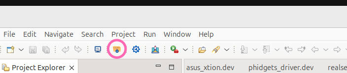
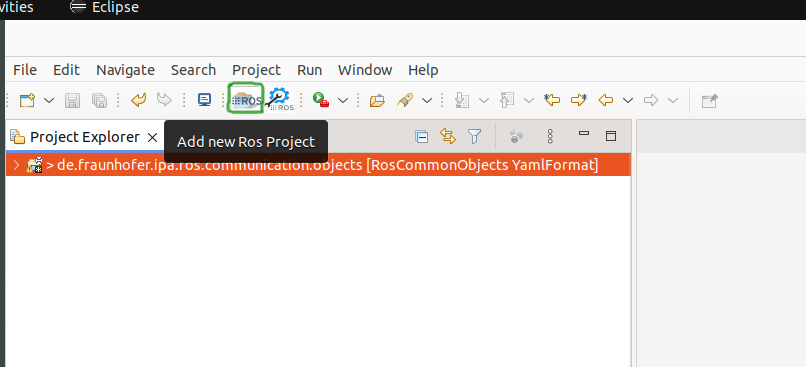
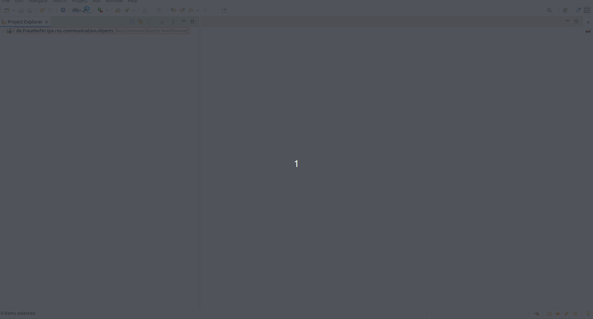

## Deployment Tooling

Welcome to the Deployment Tooling documentation page! :)

Deployment Tooling leverages model-driven engineering (MDE) principles to simplify and formalize the deployment process for robotics software. By adopting a structured, metamodel-based approach, it addresses deployment challenges such as manual errors, inefficiencies, and inconsistent artifact creation. Deployment Tooling provides models, validations, and automated artifact generation to guide stakeholders through a reliable and efficient deployment process.

We invite you to take a look at the tutorials to learn more about this tooling and its uses.

The [source code](https://github.com/ipa-rwu/deployment_plan_metamodel) of the entire implementation of the tooling is completely open-source. Contributions, feedback, and suggestions are always welcome.

### Installation

Install released version:

- [From Release](docu/Installation.md#option-1-using-the-release-version-recommended)

### Set up the environment and Import the common catalogs

You need to first switch to ROS Developer perspective to set up an environment and then switch to Deployment perspective to set up an environment.

- [Set up the environment](docu/Environment_setup.md)

### Create a deployment project

#### Pre-requirement
Before creating a deployment project, you should already have `*.rossystem` to describe your system by using **RosTooling**.
- [How to create a ROS project by using **RosTooling**]()
- [How to create a `*.rossystem` to describe your system](https://ipa320.github.io/RosTooling.github.io/docu/LearnRosSystemModels.html)
- How to create ROS component model (`*.ros2`) with **RosTooling**:
  There are 2 ways to get ROS component model (`*.ros2`)
  - [Describe a ROS node by using text editor](https://ipa320.github.io/RosTooling.github.io/docu/RosModelDescription.html)
  - [Extract component models using introspection at runtime](https://ipa320.github.io/RosTooling.github.io/docu/ros2model.html)

#### Create an empty deployment project
To create a new Project which contains skeletons of models, you can press the icon “Create New Deployment Project”.

By default, a new project with a reference to the content of the “de.fraunhofer.ipa.ros.communication.objects” and "de.fraunhofer.ipa.deployment.catalog.devices" will be created.
This new project contains an empty folder called "devices" where you can add new device models, a template of "*.planros" model and a template of "*.tarEnv" model.

### Models Review

Deployment Tooling formalizes the deployment process using metamodels, which define roles and tasks in three key phases:

1. RosSystem Models (SysModel)
   Adopted from RosTooling, RosSystem models represent software systems as interconnected components with clearly defined communication and operational interfaces. These models enable:

   A system-wide view of ROS nodes, topics, and services.
   Descriptions of connections between components, including message flows and action servers.
   Parameter definitions required for proper execution.
   RosSystem models integrate seamlessly into the deployment workflow by abstracting software systems as modular units, ready for deployment to physical setups. Developers can either generate these models from existing ROS codebases or create them manually using the RosTooling framework.

2. Target Environment Models (TarEnvModel and DevModel)
   Target environment models represent physical setups and their devices, providing detailed configurations for:

   - Hardware devices, such as robots, sensors, and computational units.
   - Communication connections (e.g., Ethernet, USB, CAN bus).

   Device models (DevModel) allow reusable definitions for commonly used hardware (e.g., UR5E robot arms or Intel RealSense cameras), while environment models (TarEnvModel) instantiate these devices for specific setups.

3. Deployment Plan Models (PlanModel)
   These models serve as a bridge between software systems (from SysModel) and the physical setup (TarEnvModel). They define:
   - Assignments of software to computation devices.
   - Parameter configurations for software execution.
   - Target environment specifications

### Tutorials

 All tutorials were created on Linux.
In addition, some of them require a local installation of Docker or Ansible.
The modeling part are required Java packages (jre and jdk). The current version of the Deployment Tooling requires Java 21 or higher.

In case you have already installed the Deployment Tooling, we recommend always pulling the latest version. Go to "Help"->"Check for Updates". If a new version is available, it will be proposed to be updated.

If you encounter issues during the execution of these tutorials, please report them under the following [https://github.com/ipa-rwu/DeploymentTooling.github.io/issues](https://github.com/ipa-rwu/DeploymentTooling.github.io/issues/new?assignees=&labels=&projects=&template=bug_report.md&title=). In case you don't have a GitHub account, please just email rwu@ipa.fhg.de.

#### Create an empty project

First you need to switch to ROS Developer perspective.
Then you can create a new Project to contain the examples. This can be done by pressing the icon "Add new ROS Project".

If the button doesn't work you can also create it manually using the Eclipse menu File -> New -> Other.. and searching for "Ros Model Project".

By default, a new project with a reference to the content of the "de.fraunhofer.ipa.ros.communication.objects" will be created. This new project contains a folder called "rosnodes" to hold the nodes description and a file with the extension .ros2 which will have an error because it is empty.

#### Introduction to Deployment Models

Deployment Tooling organizes the deployment process into three core models:

- Device Models (\*.dev)

  - Provides reusable definitions for hardware types.
  - Standardizes device specifications and capabilities.
  - [Review models and use of textual editor](docu/LearnDevModel.md)

- Target Environment Models (\*.tarenv):

  - Describes the physical setup, including hardware devices and their configurations.
  - Defines communication connections between devices.
  - [Review models and use of textual editor](docu/LearnTarEnvModel.md)

- Deployment Plan Models (\*.planros)
  - Bridges software systems and physical setups.
  - Specifies software-to-hardware assignments and execution parameters.
  - [Review models and use of textual editor](docu/LearnPlanrosModel.md)

#### Real Use Cases

- [Turtlesim](docu/UseCase-turtlesim.md)
- [Pick-and-Place Application](docu/UseCase-pickplace.md): Demonstrates deployment for a UR5E manipulator setup.
