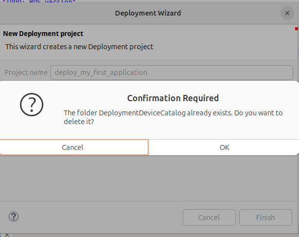

# Deployment Tooling

Welcome to the Deployment Tooling documentation page! 😊

Deployment Tooling leverages **model-driven engineering (MDE)** principles to simplify and formalize the deployment process for robotics software. By adopting a structured, metamodel-based approach, it addresses deployment challenges such as:

- Manual errors
- Inefficiencies
- Inconsistent artifact creation

Deployment Tooling provides models, validations, and automated artifact generation to guide stakeholders through a reliable and efficient deployment process.

We invite you to explore the tutorials to learn more about this tooling and its features.

The [source code](https://github.com/ipa-rwu/deployment_plan_metamodel) of the tooling is fully open-source. Contributions, feedback, and suggestions are always welcome!

---

## Installation

To install the released version:

- [Follow the instructions here](docu/Installation.md#option-1-using-the-release-version-recommended).

---

## Set Up the Environment and Import Common Catalogs

1. Switch to the **ROS Developer Perspective** to set up your environment.
2. Switch to the **Deployment Perspective** for further setup.

- [Learn more about setting up the environment](docu/Environment_setup.md).

---

## Create a Deployment Project

### Prerequisites

Before creating a deployment project, you need to have a `*.rossystem` file to describe your system, created using **RosTooling**.

- [How to create a ROS project using **RosTooling**](https://ipa320.github.io/RosTooling.github.io/docu/LearnRosSystemModels.html).
- [How to describe a system in `*.rossystem`](https://ipa320.github.io/RosTooling.github.io/docu/LearnRosSystemModels.html).
- How to create ROS component model (`*.ros2`) with **RosTooling**:
  There are 2 ways to get ROS component model (`*.ros2`)
  - [Describe a ROS node by using text editor](https://ipa320.github.io/RosTooling.github.io/docu/RosModelDescription.html)
  - [Extract component models using introspection at runtime](https://ipa320.github.io/RosTooling.github.io/docu/ros2model.html)

### Create an Empty Deployment Project

To create a new deployment project with skeleton models:

1. Click the **“Create New Deployment Project”** icon.
   

2. By default, the project includes:
   - A reference to “`de.fraunhofer.ipa.ros.communication.objects`” and "`de.fraunhofer.ipa.deployment.catalog.devices`".
   - An empty folder called `devices` where you can add new device models.
   - Templates for `*.planros` and `*.tarEnv` models.

If the catalogs are already imported, you may see a dialog box like this:
   

> ⚠️ **Important:** Clicking **OK** will delete the current project and reimport it from the GitHub repository. Any unsaved changes or local modifications to the project will be lost. Ensure you commit or back up your changes before proceeding.

---

## Models Overview

Deployment Tooling organizes the deployment process into three core models:

1. **RosSystem Models (`*.rossystem`)**:
   - Represent software systems as interconnected components.
   - Provide a system-wide view of ROS nodes, topics, and services.
   - Describe component connections, message flows, and action servers.

   [Learn more about RosSystem Models](https://ipa320.github.io/RosTooling.github.io/docu/LearnRosSystemModels.html).

2. **Target Environment Models (`*.tarEnv` and `*.dev`)**:
   - Represent physical setups, including hardware devices and configurations.
   - Include communication connections (e.g., Ethernet, USB).

   [Learn more about Target Environment Models](docu/LearnTarEnvModel.md).

3. **Deployment Plan Models (`*.planros`)**:
   - Bridge software systems and physical setups.
   - Define software-to-hardware assignments and execution parameters.

   [Learn more about Deployment Plan Models](docu/LearnPlanrosModel.md).

---

## Tutorials

> ⚠️ **Note:** All tutorials were created on Linux. Some require Docker or Ansible and Java packages (JRE and JDK). The current version requires Java 21 or higher.

To ensure you're using the latest version, go to **Help** → **Check for Updates**. If a new version is available, update as prompted.

---

## Real Use Cases

- [Turtlesim](docu/UseCase-turtlesim.md)
- [Pick-and-Place Application](docu/UseCase-pickplace.md): Demonstrates deployment for a UR5E manipulator setup.

---

## Reporting Issues

If you encounter any issues:
- Submit them to the [GitHub Issue Tracker](https://github.com/ipa-rwu/DeploymentTooling.github.io/issues/new).
- Alternatively, email us at **rwu@ipa.fhg.de**.

---

This documentation aims to help you get started with Deployment Tooling and streamline your robotics software deployment process.
