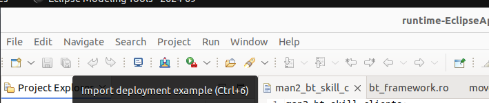

# Setup the environment and start the Eclipse application

## Setup an environment for ROS Developer

### Switch to the ROS Developer perspective

Go to Menu Window -> Perspective -> Open Perspective -> Other... -> ROS developer. Your application toolbar will be automatically configured.

### Import the common communication objects project

import the project located under the "ROSCommonObjects" folder of this repository to the workbench of your application:

```
de.fraunhofer.ipa.ros.communication.objects
```

If you have internet a button can clone from GitHub the objects to your workspace and import them automatically:


 This button will only work on Linux machines. Alternatively, you can clone manually the [repository](https://github.com/ipa320/RosCommonObjects) and import the project by File -> Import -> General -> Existing Projects into Workspace. Then select the container folder of the cloned repository.

## Setup an environment for Deployment Developer

Go to Menu Window -> Perspective -> Open Perspective -> Other... -> ROS Deployment. Your application toolbar will be automatically configured.


### Import an example

If you have internet a button can clone from GitHub the objects to your workspace and import them automatically:



 This button will only work on Linux machines. Alternatively, you can clone manually the [repository](https://github.com/ipa-rwu/ROSDeploymentExample) and import the project by File -> Import -> General -> Existing Projects into Workspace. Then select the container folder of the cloned repository.
