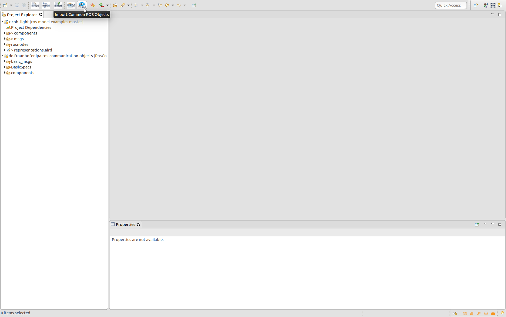
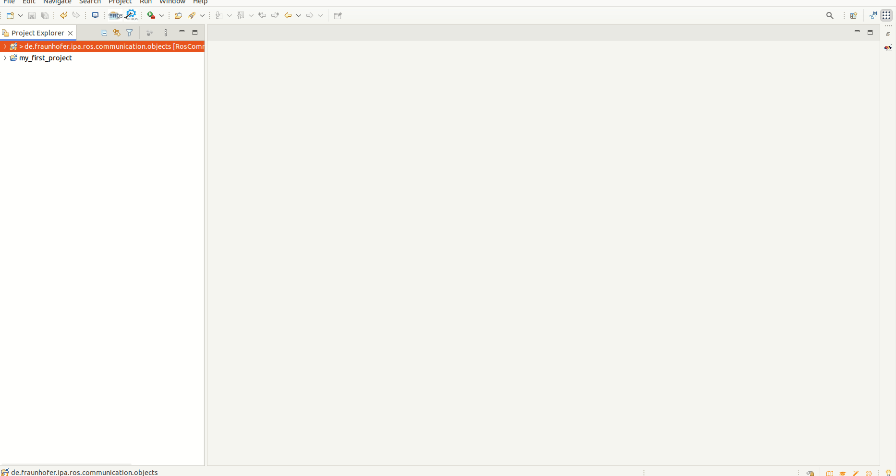
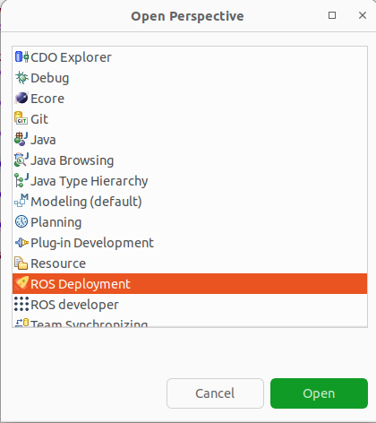
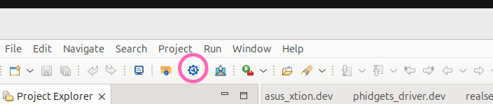
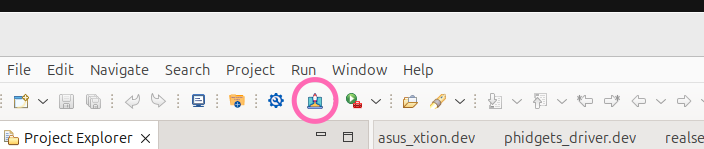

# Set Up the Tooling Environment in Eclipse

## Setting Up the Environment for ROS Development

### Step 1: Switch to the ROS Developer Perspective

1. Open the menu: `Window > Perspective > Open Perspective > Other...`
2. Select `ROS Developer`.
3. Your application toolbar will automatically configure itself for ROS development.

---

### Step 2: Import the Common Communication Objects Project

1. If you have an internet connection, use the one-click button to clone the objects from GitHub and automatically import them into your workspace:

   

   > **Note**: This button is only available on Linux machines.

2. Alternatively, manually clone the repository:
   [ipa320/RosCommonObjects](https://github.com/ipa320/RosCommonObjects).
   - Open Eclipse and navigate to `File > Import > General > Existing Projects into Workspace`.
   - Select the folder containing the cloned repository and import it.

---

### Step 3: Import the Catalog of Software Components

1. Download and import the pre-existing catalog of examples from GitHub:
   [ipa-nhg/RosModelsCatalog](https://github.com/ipa-nhg/RosModelsCatalog).
2. Clone the repository manually and import it into Eclipse:
   - Go to `File > Import > General > Existing Projects into Workspace`.
   - Select the folder containing the cloned repository.

   

---

## Setting Up the Environment for Deployment Development

### Step 1: Switch to the ROS Deployment Perspective

1. Open the menu: `Window > Perspective > Open Perspective > Other...`
2. Select `ROS Deployment`.
3. Your application toolbar will automatically configure itself for deployment development.

   

---

### Step 2: Import the Device Catalog

1. This catalog includes commonly used device models and is available on GitHub:
   [ipa-rwu/DeploymentDeviceCatalog](https://github.com/ipa-rwu/DeploymentDeviceCatalog).
2. If you have an internet connection, use the one-click button to clone and import the catalog into your workspace:

   

   > **Note**: This button is only available on Linux machines.

3. Alternatively, manually clone the repository:
   - Navigate to [ipa-rwu/DeploymentDeviceCatalog](https://github.com/ipa-rwu/DeploymentDeviceCatalog).
   - Import it into Eclipse using `File > Import > General > Existing Projects into Workspace`.

---

### Step 3 (Optional): Import an Example Project

1. Import an example project from GitHub:
   [ipa-rwu/ROSDeploymentExample](https://github.com/ipa-rwu/ROSDeploymentExample.git).
2. If you have an internet connection, use the one-click button to clone and import the example project:

   

   > **Note**: This button is only available on Linux machines.

3. Alternatively, manually clone the repository:
   - Navigate to [ipa-rwu/ROSDeploymentExample](https://github.com/ipa-rwu/ROSDeploymentExample).
   - Import it into Eclipse using `File > Import > General > Existing Projects into Workspace`.
