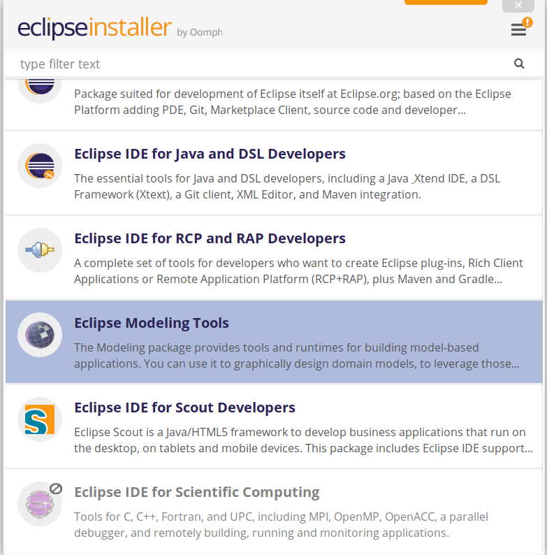
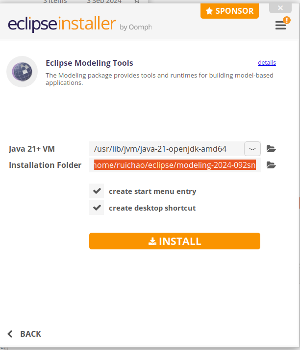
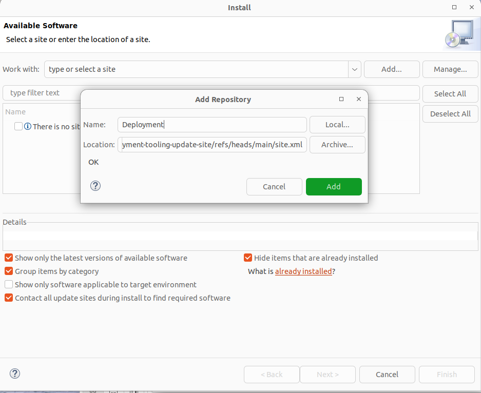
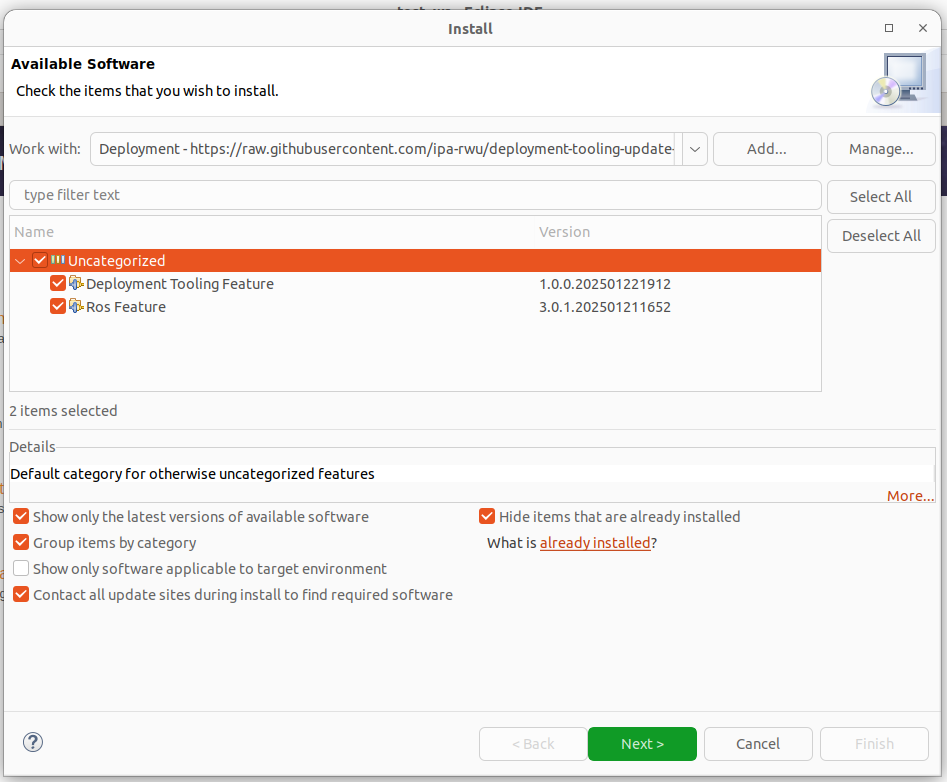

# Installation and Setup

## Install the Python Package "dhelp"

The `dhelp` package is used by the generator to check if the ROS packages required by a system (defined in `*.rossystem`) are released. If they are not, it will add them to a `*.repos` file if a Git repository is defined in the `*.ros2` model. For example: [my_awesome_pkg](https://github.com/ipa320/RosTooling.github.io/blob/main/docu/RosModelDescription.md?plain=1#L63).

### Steps to Install `dhelp`

1. Clone the repository:
    ```bash
    git clone git@github.com:ipa-rwu/dhelp.git
    # Alternatively:
    git clone https://github.com/ipa-rwu/dhelp.git
    ```

2. Ensure the `venv` Module is Installed
    ```
    sudo apt install python3-venv
    ```
3. Navigate to the `dhelp` folder and run the installation script:
    ```bash
    ./install.sh
    ```
    This will create a folder named `venv`, which is a virtual environment for the Python installation. The `dhelp` package will be installed here.

4. Add the `venv/bin` directory to your `PATH` environment variable:
    ```bash
    echo 'export PATH="<full_path_to_venv>/bin":$PATH' >> ~/.bashrc
    # Example:
    echo 'export PATH=/home/john/deployment_ws/dhelp/venv/bin:$PATH' >> ~/.bashrc
    source ~/.bashrc
    ```

---

## Option 1: Using the Release Version (Recommended)

### Setting Up Java

Install Java Runtime Environment (JRE) for Linux with the following command:

```bash
sudo apt-get install openjdk-21-jre
```

### Installing Eclipse

1. Download the Eclipse installer (version: **2024-09**) from the [official Eclipse website](https://www.eclipse.org/downloads/packages/release/2024-09/r).
2. Unpack the downloaded file and run the installer:
    ```bash
    ./eclipse-inst
    ```
3. In the installer, select "Eclipse Modeling Tools" from the available packages. Use the search tool to find it quickly:
    
4. Proceed to the next steps:
    - Choose Java version 21.
    - Specify the installation directory for Eclipse.
    
5. Accept the license agreements and complete the installation.

### Installing Deployment Tooling

1. Open Eclipse and navigate to `Help > Install New Software...`.
2. Add the update site URL in the `Work with` field:
   [Deployment Tooling Update Site](https://raw.githubusercontent.com/ipa-rwu/deployment-tooling-update-site/refs/heads/main/site.xml).

   

3. If no package appears, uncheck the option `Group items by category`. Select the `Deployment Tooling Feature` and `ROS Feature` (if not already installed):
   
4. Click `Next` to review and accept the license agreements. If a security warning appears, click `OK`. Restart Eclipse after the installation.

---

## Option 2: Using the Source Code (For Tooling Developers)

_This section is a placeholder for future documentation._

---

## Starting the Tooling

1. Open a terminal and navigate to the Eclipse installation directory.
2. Verify the `PATH` environment variable includes the `venv/bin` path:
    ```bash
    echo $PATH
    ```
3. Start Eclipse:
    ```bash
    ./eclipse
    ```
4. Follow the steps in [Set up the tooling environment in Eclipse](Environment_setup.md).
