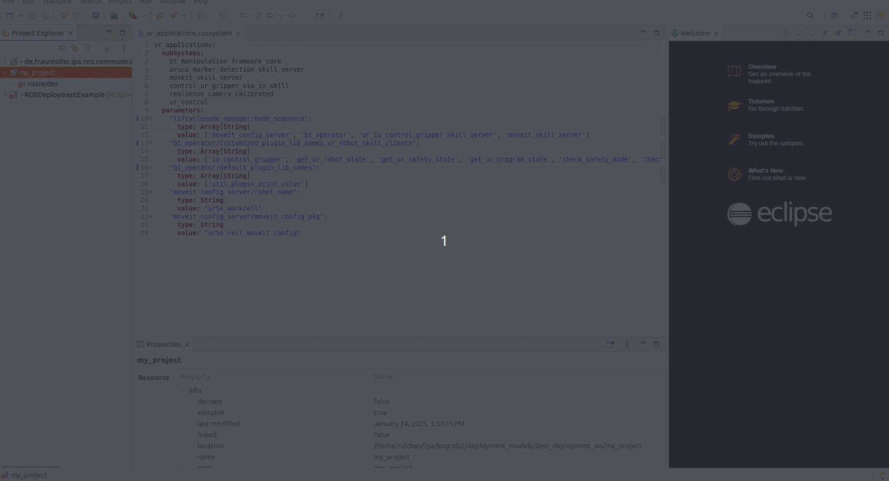
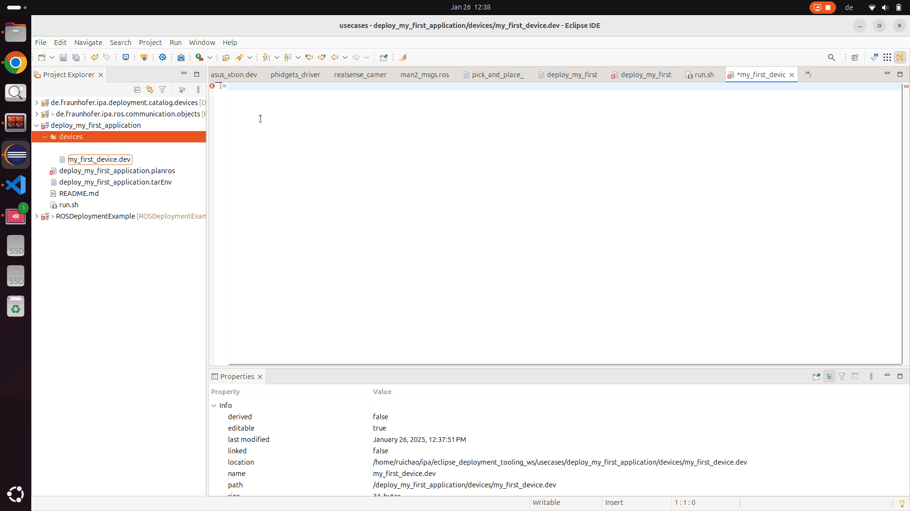

# Learning DevModel

## Overview

The **DevModel** (`*.dev`) is a reusable representation of hardware devices used in deployment. It provides detailed specifications, communication interfaces, and operational parameters for each device type. These models form the building blocks of the **Target Environment Model** (`TarEnvModel`, `*.tarEnv`), enabling seamless deployment across diverse physical setups.

This guide explains how to understand and create **DevModel** instances using examples from the [ipa-rwu/ROSDeploymentExample](https://github.com/ipa-rwu/ROSDeploymentExample.git).

---

## Example: Defining a Device Model

Here is an example of a device model for a **UR5E Robot Arm** (`ur5e.dev`). This model includes details about communication interfaces and device-specific properties.

You can find this example file in the project `de.fraunhofer.ipa.deployment.catalog.devices` after importing the **Device Catalog**. See [Import the Device Catalog](Environment_setup.md#import-the-device-catalog).

### Example File: [`ur5e.dev`](https://github.com/ipa-rwu/DeploymentDeviceCatalog/blob/main/de.fraunhofer.ipa.deployment.catalog.devices/ur5e.dev)

```yaml
DeviceType:
  name: UR5E
  deviceResource:
    - name: device_info
      type: DeviceInformation
      properties:
        - name: type
          kind: AttributeKind
          value: ur5e
  communicationConnection:
    - name: io_tip
      type: IO
      properties:
        - name: pin_dio_0
          kind: AttributeKind
          value: 0
        - name: pin_dio_1
          kind: AttributeKind
    - name: ethernet
      type: Ethernet
      properties:
        - name: ip_address
          kind: AttributeKind
        - name: interface_name
          kind: AttributeKind
        - name: mac_address
          kind: AttributeKind
        - name: identity_name
          kind: AttributeKind
        - name: gateway
          kind: AttributeKind
        - name: subnet_mask
          kind: AttributeKind
        - name: dns_server
          kind: SelectionKind
```

---

### Key Elements of the Example

- **name**: A unique identifier for the device (e.g., `UR5E`).
- **deviceResource**: Describes the resources available for the device, such as `DeviceInformation`.
- **communicationConnection**: Defines communication interfaces (e.g., Ethernet, IO) and their properties (e.g., IP address, interface name).

---

## Creating Your Own DevModel

### Step 1: Create an Empty DevModel

1. Create a new deployment project by following [Create an empty project](../README.md#create-an-empty-deployment-project).
2. In the `devices` folder of the project, create a `*.dev` file.
3. Open the file with the **Device Editor**:

   

---

### Step 2: Use Autocomplete for Assistance

- Use `Ctrl + Space` while editing the file to see hints and suggestions:

   

---

### Step 3: Mandatory Information

#### For Non-Computational Devices
Use `DeviceType` to describe non-computational devices:

```yaml
DeviceType:
  name: "Name of Device Type"
```

#### For Computational Devices
Use `ComputationDeviceType` for devices with computational capabilities:

```yaml
ComputationDeviceType:
  name: SimplePC
  computationResource:
    - name: os
      type: LinuxOperatingSystem
      properties:
        - name: os_name
          kind: AttributeKind
        - name: os_version
          kind: AttributeKind
    - name: processor
      type: Processor
      properties:
        - name: core_number
          kind: AttributeKind
        - name: processor_architecture
          kind: AttributeKind
```

---

### Assigning Values in the Target Environment Model

The properties defined in the `*.dev` file can be assigned values in the **Target Environment Model** (`*.tarEnv`). This allows you to customize device configurations for specific deployments.
