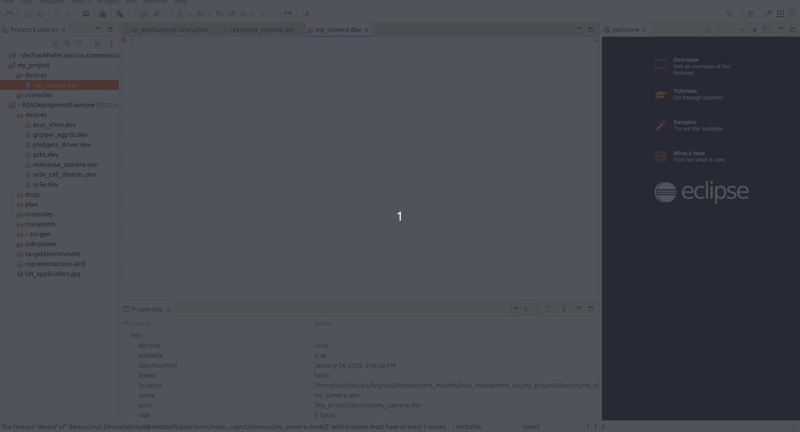

# Learning DevModel

## Overview

The **DevModel** is a reusable representation of hardware devices used in deployment. It provides detailed specifications, communication interfaces, and operational parameters for each device type. These models form the building blocks of the **Target Environment Model** (`TarEnvModel`), enabling seamless deployment across diverse physical setups.

This section guides you through understanding and creating **DevModel** instances using examples from the [ROS Deployment Example repository](https://github.com/ipa-rwu/ROSDeploymentExample/tree/main/ROSDeploymentExample/devices).

---

## Example: Defining a Device Model

In this example, we define a device model for a **UR5E Robot Arm**, detailing its communication interfaces and device-specific properties.

### Example File: [`ur5e.dev`](https://github.com/ipa-rwu/ROSDeploymentExample/blob/main/ROSDeploymentExample/devices/ur5e.dev)

The `.dev` file is structured as follows:

```yaml
DeviceType:
  name: UR5E
  deviceResource:
    - name: device_info
      type: DeviceInformation
      properties:
        - name: type
          kind: AttributeKind
          value: ur5e
  communicationConnection:
    - name: io_tip
      type: IO
      properties:
        - name: pin_dio_0
          kind: AttributeKind
          value: 0
        - name: pin_dio_1
          kind: AttributeKind
    - name: ethernet
      type: Ethernet
      properties:
        - name: ip_address
          kind: AttributeKind
        - name: interface_name
          kind: AttributeKind
        - name: mac_address
          kind: AttributeKind
        - name: identity_name
          kind: AttributeKind
        - name: gateway
          kind: AttributeKind
        - name: subnet_mask
          kind: AttributeKind
        - name: dns_server
          kind: SelectionKind
```

Key Elements

- Name: A unique identifier for the device (e.g., UR5E).
- Type: The category of the device (e.g., RobotManipulator).
- Communication: Defines the communication type (e.g., Ethernet) and protocol (e.g., TCP/IP).
- Properties: Lists specific attributes of the device.

## Creating Your Own Simple DevModel

First you should create your own project by following
[Create an empty project](../README.md#create-an-empty-project)

You can create a folder to store all device models. Then you create a "\*.dev" file and open with "Device Editor" as shown in below:


When you edit this file you can use "Ctrl + Space" to get hint, for example:


If you would like to describe a non-computational device, then you can choose "DeviceType"
The mandatory information of a device model for "DeviceType" is as follows:

```yaml
DeviceType:
  name: "Name of Device Type"
```

If you would like to describe a computational device, then you can choose "ComputationDeviceType"
The mandatory information of a device model for "ComputationDeviceType" is as follows:

```yaml
ComputationDeviceType:
  name: SimplePC
  computationResouce:
    - name: os
      type: LinuxOpertingSystem
      properties:
        - name: os_name
          kind: AttributeKind
        - name: os_version
          kind: AttributeKind
    - name: processor
      type: Processor
      properties:
        - name: core_number
          kind: AttributeKind
        - name: processor_architecture
          kind: AttributeKind
```

You can assign values to these properties in the TargetEnv model
