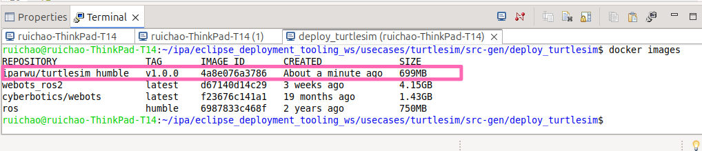
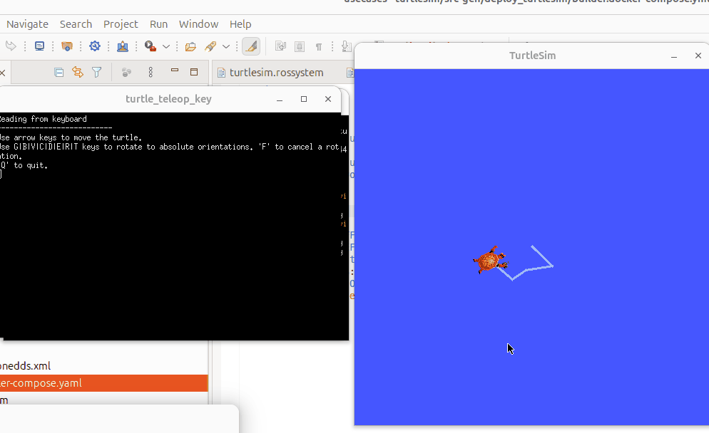

# Hands-on Example for the Turtlesim 

The Turtlesim tutorial is a classic introductory exercise in learning ROS. It provides a graphical interface where a turtle can be controlled using speed commands, similar to those used in robotic bases. For more details, check out the [official Turtlesim tutorial](https://docs.ros.org/en/foxy/Tutorials/Beginner-CLI-Tools/Introducing-Turtlesim/Introducing-Turtlesim.html).

This example demonstrates deploying a system that includes two nodes: the Turtlesim node and the teleoperation node. The ROS models for these nodes are as follows:

---

## ROS Models (`turtlesim.ros2`)

The following YAML defines the Turtlesim and teleoperation nodes:

```yaml
turtlesim:
  artifacts:
    turtle_teleop_key:
      node: turtle_teleop_key
      publishers:
        cmd_vel:
          type: "geometry_msgs/msg/Twist"
      parameters:
        scale_angular:
          type: Double
          default: 2.0
        scale_linear:
          type: Double
          default: 2.0
    turtlesim_node:
      node: turtlesim_node
      publishers:
        color_sensor:
          type: "turtlesim/msg/Color"
        pose:
          type: "turtlesim/msg/Pose"
      subscribers:
        cmd_vel:
          type: "geometry_msgs/msg/Twist"
      serviceservers:
        teleport_absolute:
          type: "turtlesim/srv/TeleportAbsolute"
        spawn:
          type: "turtlesim/srv/Spawn"
        set_pen:
          type: "turtlesim/srv/SetPen"
        reset:
          type: "std_srvs/srv/Empty"
        kill:
          type: "turtlesim/srv/Kill"
        teleport_relative:
          type: "turtlesim/srv/TeleportRelative"
        clear:
          type: "std_srvs/srv/Empty"
```

---

## System Model (`turtlesim.rossystem`)

The following YAML represents the system model for the two nodes:

```yaml
turtlesim_system:
  nodes:
    turtlesim:
      from: "turtlesim.turtlesim_node"
      interfaces:
        - cmd_subscriber: sub-> "turtlesim_node::cmd_vel"
    key_teleop:
      from: "turtlesim.turtle_teleop_key"
      interfaces:
        - cmd_publisher: pub-> "turtle_teleop_key::cmd_vel"
  connections:
    - [cmd_publisher, cmd_subscriber]
```

If you are unfamiliar with creating ROS models, refer to:
[How to create the component model (*.ros2) and system model (*.rossystem)](../README.md#pre-requirement)

---

## Step-by-Step Guide

### Step 1: Create a New Project

Follow the instructions in "[Create an empty deployment project](../README.md#create-a-deployment-project)" to create a project named `turtlesim`.


---

### Step 2: Create Software Component Models (`*.ros2`) and System Model (`*.rossystem`)


After creating the system model, the **RosTooling** generator will automatically run if there are no errors. A `src-gen` folder will appear in your project, containing the generated files.

---

### Step 3: Update the Target Environment Model (`turtlesim.tarEnv`)

Update the computation device name in the target environment model. To reference a model such as `refDeviceType: PC`, hold the **CTRL** key, hover over `PC`, and click to jump to the referenced model.


---

### Step 4: Update the Plan Model (`turtlesim.planros`)

Rename the plan model to `deploy_turtlesim`. Once the model is created and passes all validation checks, a folder named `deploy_turtlesim` will be generated in the `src-gen` folder. This folder contains the deployment artifacts.


---

### Step 5: Use Deployment Artifacts

#### Create Docker Images

1. Locate `build_docker.sh` in the `deploy_turtlesim` folder.
2. Right-click it and select **Show In Local Terminal** to open a terminal in Eclipse.
3. Ensure you have [Docker](https://docs.docker.com/engine/install/ubuntu/) and [Docker Compose](https://docs.docker.com/compose/install/linux/) installed.
4. Make `build_docker.sh` executable:
   ```
   chmod 777 build_docker.sh
   ```
4. Run the bash file to build the Docker images:
   ```bash
   ./build_docker.sh
   ```


After the building process finishing, you can check docker images by running the command
```
docker images
```


---

#### Launch the System in a Docker Container

1. Find the folder named after your computation device in the `deploy_turtlesim` folder.
2. Locate the `docker-compose.yaml` file within it.
3. Run the following command to launch the Turtlesim application:
   ```bash
   xhost +
   ```
   ```bash
   docker compose up
   ```
   

4. Play with the turtle:
    Using the terminal of the keyboard node you can use the arrows to send new commands to the turtle.

    


---
You can find this example [ipa-rwu/deployment_use_case_turtlesim](https://github.com/ipa-rwu/deployment_use_case_turtlesim)
