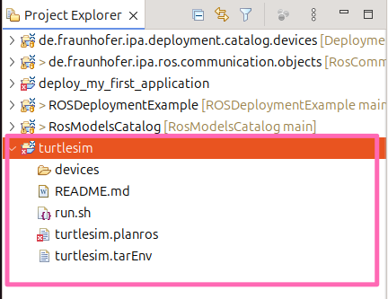

# Hands-on example for the Turtlesim node []

To learn ROS one of the first tutorials that everyone does is turtlesim.

Basically, it is a small graphical interface where a turtle can be moved using the speed commands of any robotic base in ROS. [Official TurtleSim tutorial](https://docs.ros.org/en/foxy/Tutorials/Beginner-CLI-Tools/Introducing-Turtlesim/Introducing-Turtlesim.html)

We will use it as an example to show the models.
Let's imagine that we want to deploy a system including two nodes, one of them is the turtlesim and the other is the node to teleoperate it.

The ROS models (turtlesim.ros2) for these two nodes as follows:
```yaml
turtlesim:
  fromGitRepo: "https://github.com/ros/ros_tutorials/"
  artifacts:
    turtle_teleop_key:
        node: turtle_teleop_key
        publishers:
          cmd_vel:
            type: "geometry_msgs/msg/Twist"
        parameters:
          scale_angular:
            type: Double
            default: 2.0
          scale_linear:
            type: Double
            default: 2.0
    turtlesim_node:
      node: turtlesim_node
      publishers:
        color_sensor:
          type: "turtlesim/msg/Color"
        pose:
          type: "turtlesim/msg/Pose"
      subscribers:
        cmd_vel:
          type: "geometry_msgs/msg/Twist"
      serviceservers:
        teleport_absolute:
          type: "turtlesim/srv/TeleportAbsolute"
        spawn:
          type: 'turtlesim/srv/Spawn'
        set_pen:
          type: 'turtlesim/srv/SetPen'
        reset:
          type: "std_srvs/srv/Empty"
        kill:
          type: 'turtlesim/srv/Kill'
        teleport_relative:
          type: 'turtlesim/srv/TeleportRelative'
        clear:
          type: 'std_srvs/srv/Empty'
```

The system can be represented in "turtlesim.rossystem" as follows:
```yaml
turtlesim_system:
  nodes:
    turtlesim:
      from: "turtlesim.turtlesim_node"
      interfaces:
        - cmd_subscriber: sub-> "turtlesim_node::cmd_vel"
    key_teleop:
      from: "turtlesim.turtle_teleop_key"
      interfaces:
        - cmd_publisher: pub-> "turtle_teleop_key::cmd_vel"
  connections:
   -[ cmd_publisher , cmd_subscriber]
```

If you want to know how to create ROS models, you can check links here:
[How to create the component model (*.ros2) and the system model (*.rossystem)](../README.md#pre-requirement)

## Step 1: Create a new project
To learn how to create a project you can follow the section "[Create an empty deployment project](../README.md#create-a-deployment-project)"

We create a project named as "turtlesim" as shown below.



## Step 2: Create software component models (*.ros2) and a system model (*.rossystem)


## Step 3: Update the Target Environment Model (`turtlesim.tarEnv`)
We updated the name of computation device.
If you want to check a reference model such as `refDeviceType: PC`, you can hold the key "CTRL", move your mouse to `PC` and then click it. It will jump to the referenced model.


## Step 4: Update the Plan Model (`turtlesim.planros`)
